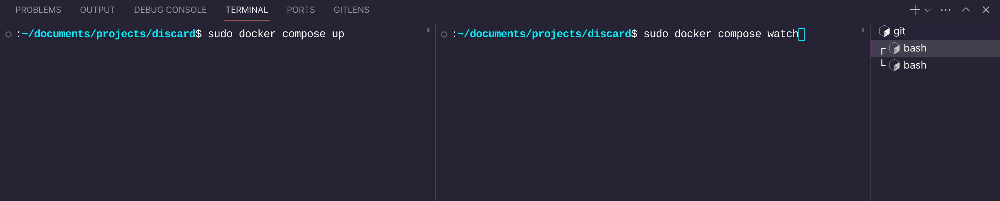
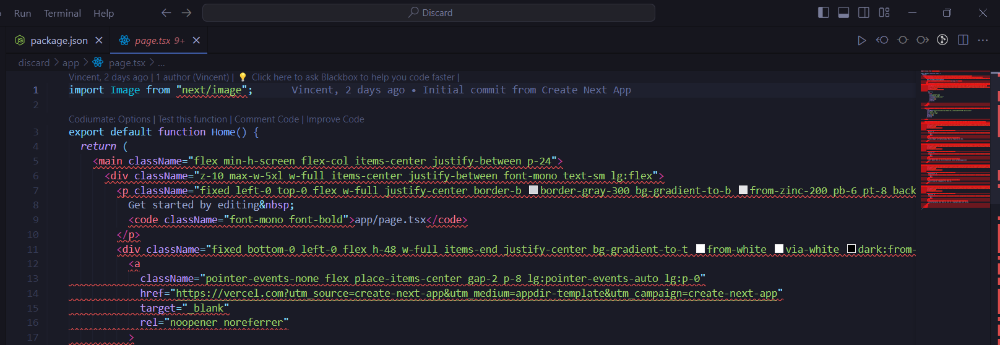
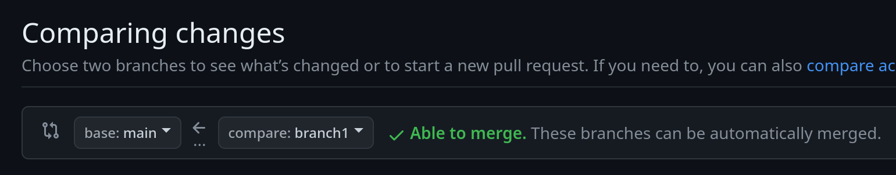

# Discard

Discard is a fun, light-hearted project created by a group of friends as a simpler version of Discord with the aim of learning web development and working in a team environment. It's a web application that allows users to communicate with each other in real-time, much like Discord.

## Features

- Real-time chat: Send and receive messages instantly.
- To be added

## Getting Started

These instructions will get you a copy of the project up and running on your local machine for development and testing purposes.

### Prerequisites

Things you will need to install to get the project running on your local machine:
- IDE or Code Editor of your choice
- [Docker](https://www.docker.com/products/docker-desktop/)
- [Git](https://git-scm.com/book/en/v2/Getting-Started-Installing-Git)

### Running the project


**If you encounter any issues while setting up or running the project, feel free to contact me on Discord @vinmeil.**

1. Clone the github repository onto your local machine if you haven't already (Only need to do 1 time):
```
git clone https://github.com/vinmeil/discard.git
```

2. Open 2 separate instances of your terminal or command prompt and make sure you are in the correct directory. You can do this from within VSCode.

3. Running docker:
- For MacOS and Linux, in your 2 instances of your terminals, run:
```
sudo docker compose up
```
```
sudo docker compose watch
```

**Image for reference:**


- For Windows, in your 2 instances of your terminals, run:
```
docker compose up
```
```
docker compose watch
```

**NOTE: For windows, if you are getting an error regarding permissions, run VSCode as administrator and see if that works.*

4. Wait for docker to finish loading. Once it is done loading, head over to [http://localhost:3000](http://localhost:3000) to view the project.

### Dealing with VSCode errors

If you are having an issue where the whole file is giving an error,



Run the following command:
```
npm install
```

Note that even though you are encountering errors, the website will still run fine on [localhost](http://localhost:3000) as it runs using docker, not on your own machine. Although this may be the case, it is recommended that you run `npm install` to get rid of the errors so that you can see where the actual errors are.

## Git & Github Workflow

### Pulling code from main branch

If you have made changes to your branch but your branch is behind main (due to someone else's branch being merged to main), do the following:

1. Stash your changes:
```
git stash
```

2. Switch to the main branch:
```
git checkout main
```

3. Pull the latest changes from the main branch:
```
git pull origin main
```

4. Switch back to your own branch:
```
git checkout <name of branch you were working on>
```

5. Merge the changes from main with your branch:
```
git merge main
```

6. Add back the changes you've previously stashed into you branch:
```
git stash pop
```

7. Resolve any conflicts if there are any.

### Pushing code to github

When working on a new feature or page, make sure to work in a branch that is not the `main` branch. To do this, in your terminal run:
```
git checkout -b <your new branch name>
```

To switch between branches, in your terminal run:
```
git checkout <branch you want to switch to>
```

To push your changes to github, do the following:
1. Make sure you are in the correct directory, and add the files that you want to be uploaded to github:
```
git add .
```
or
```
git add -A
```

2. Commit your changes and add a meaningful message:
```
git commit -m "<enter your message here, e.g. create navbar component>"
```

3. Push the changes onto your branch in github:
```
git push origin <your current branch name>
```

4. If your branch is not up to date with main, make sure to pull changes from main before pushing your changes or opening a pull request.

### Opening a pull request

Open a pull request when you think you're done with your feature. It allows people to review your code to make sure everything is alright before merging it to the main branch.

How to open a pull request:

1. Go to the github repository's main page.
2. Go to the `Pull requests` tab at the top.
3. Click on `New pull request`.
4. Set the base to `main` and compare to `your branch`.

**Image for reference:**

5. Make sure it says `Able to merge`.\
6. Click on `Create pull request`.\
7. Tell someone that you've made a pull request so it can be reviewed.

## License

This project is not licensed and is intended for educational purposes. Please do not use it to create a public product. If you wish to use it for private, educational purposes, please contact the authors.

## Authors
- Vincent Wesley Liem - [vinmeil](https://github.com/vinmeil)
- Daven Japhis Tan - [Skooyo](https://github.com/Skooyo)
- Ryan Dyson Darmawan - [RyanDyson](https://github.com/RyanDyson)

## Acknowledgements
- [Discord](https://discord.com/) - Serves as an inspiration to our project, including the UI/UX and idea of our project.
